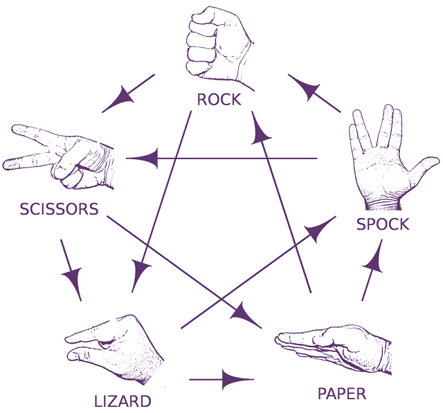

# Rock, Paper, Scissors, Lizard, Spock
The game Rock, Paper, Scissors, Lizard, Spock is an extension of the original classic Rock, Paper, Scissors, which is used by all ages to settle disputes or just to have a little fun. For more on the game, it's rules and it's origin, visit the [How to Play Rock Paper Scissors Lizard Spock](https://www.wikihow.com/Play-Rock-Paper-Scissors-Lizard-Spock) fandom page.

## Rules
The rules are as follows:

- `Scissors` cuts `Paper`
- `Paper` covers `Rock`
- `Rock` crushes `Lizard`
- `Lizard` poisons `Spock`
- `Spock` smashes `Scissors`
- `Scissors` decapitates `Lizard`
- `Lizard` eats `Paper`
- `Paper` disproves `Spock`
- `Spock` vaporizes `Rock`
- `Rock` crushes `Scissors`



## Tech stack
- .NET 6
- Microsoft.AspNetCore
- MediatR
- xUnit
- Moq
- React

## Terminology
- `GameChoice` - represents choice object using `ChoiceKind`
- `GameMatchResult` - represents a result from `GameMatch`
- `GameMatch` - game match between `Player` and `Bot`
- `Player` - user submitted `GameChoice`
- `Bot` - random generated `GameChoice` from the _computer_
- `GameRule` - rule of the game for each `ChoiceKind`
- `ChoiceKind` - actual choice as any of `Rock, Paper, Scissors, Lizard, Spock`
- `GameMatchResultKind` - actual result from a `GameMatch` as any of `Lose, Tie, Win`

## Assumptions
- The game is accessible to anybody - i.e. there are not authentication restrictions. 
- Match results are not persistent
- API endpoints does not use `api/` prefix
- API endpoint versioning is enabled but not used

## Project Structure
- `./GameDot.Api` - Web API endpoints for the game
- `./GameDot.Application` - Mediator pattern for handling game interaction
- `./GameDot.Core` - Core functionality definitions
- `./GameDot.Infrastructure` - Service implementations and application dependencies 
- `./Test/GameDot.Tests.Api` - Test project for testing `GameDot.Api` project
- `./Test/GameDot.Tests.Application` - Test project for testing `GameDot.Application` project

## Application configuration
The following configurations need to be set in `GameDot.Api`, file `./GameDot.Api/appsettings.json`:
```javascript
{
    // ...

    // URL to random service provider. The expected result object is defined below
    "RandomServiceUrl": "https://rpssl.olegbelousov.online/random",

    // Custom settings for the application
    "GameDotSettings": {

        // Described whenever to use integrated random logic in case of any errors when consuming RandomServiceUrl
        "UseRandomRedundancy": "true"
    }
    // ...
}
```

* the expected result object of `RandomServiceUrl` is with the following structure:
``` javascript
{
    "random": 123 // expected range [0 - 255]
}
``` 

## Run with Visual Studio
- Open `GameDot.sln` with Visual Studio 2022
- Set project `GameDot.Api` as startup project
- Select the desired run profile
- Run or Debug the project
- Open browser and navigate to `http://localhost:35041/index.html`

## Run with Docker
To build the docker image, run the following command:
```
docker build -t gamedot-api .
```

To Start the docker image, run the following command:
```
docker run -d -p 8080:80 gamedot-api
```

To open the docker started web app, navigate to `http://localhost:8080`

## Run web client
- Navigate to folder `GameDot.Web`:
```
cd GameDot.Web
```

- Set environment variables in `.env` file:
```
REACT_APP_BASE_URL=http://localhost:35041: # GameDot API base URL
```

- Install packages:
```
npm install
```

- Running the web client:
```
npm run start
```

To open the docker started web app, navigate to `http://localhost:3000`
